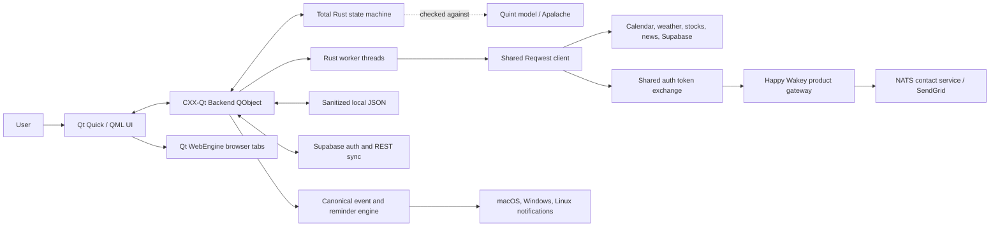
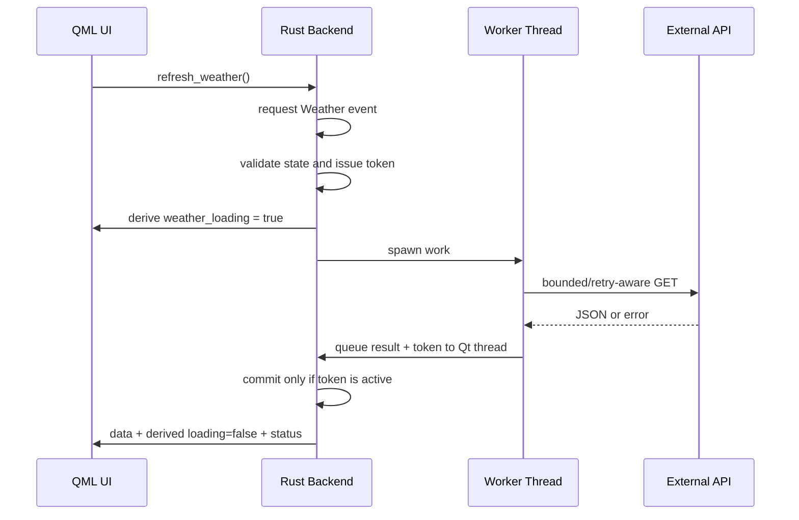

# Architecture and Tech Stack

## Is It a Native Desktop App?

Yes. The primary application is a native Qt window. It does not render its navigation, panels, or controls with HTML/CSS. QML describes a Qt Quick scene graph and Qt Controls render the application UI through the platform's graphics stack.

Qt WebEngine appears only inside the Browser panel, where rendering web pages is the feature itself.

## Is It Cross-Platform?

The source architecture is cross-platform across macOS, Windows, and Linux:

- Rust supports all three operating systems.
- Qt 6 Quick, Controls, and WebEngine support all three.
- CXX-Qt generates the Rust/C++/QObject bridge for each target.
- Reqwest with Rustls provides portable HTTPS networking.
- Serde JSON, Chrono, URL, and the remaining Rust libraries are portable.

It is not one universal binary. Each operating system needs a native build that links and packages the correct Qt libraries and WebEngine resources. Platform signing and installers are also different.

## High-Level Structure

The local reminder path is implemented: normalized calendar events feed a 20-second Rust worker, configurable offsets, and an atomic deduplication ledger. `notify-rust` supplies the current native notification adapter. An optional cloud path reconciles deterministic future reminder jobs to a small Rust gateway so email can be delivered while the app is closed. Durable event caching, snooze/actions, and installed-package acceptance on Windows and Linux remain future work.

## Runtime Lifecycle

1. `main()` loads environment configuration.
2. A tiny C++ shim calls `QtWebEngineQuick::initialize()` before QML loads a `WebEngineView`.
3. Rust constructs `QGuiApplication` and `QQmlApplicationEngine`.
4. The engine loads `MainWindow.qml` from the compiled Qt resource path.
5. CXX-Qt exposes one QML singleton named `Backend`.
6. QML reads typed Backend properties and invokes typed Backend methods.
7. The private Rust state machine accepts or rejects the requested event.
8. Accepted asynchronous effects receive a monotonically increasing operation token.
9. Rust starts blocking network work on worker threads.
10. Results are queued back onto the Qt GUI thread and may commit only if their token is still active.
11. Rust serializes service results and the machine snapshot as JSON strings; QML parses them into view models.

The GUI thread never intentionally performs provider HTTP calls.

## Rust and QML Bridge

`src/main.rs` defines a CXX-Qt bridge and a generated `QObject`. Important properties include:

- identity: `logged_in`, `user_email`, `user_id`;
- formal control state: `auth_state`, `auth_busy`, `onboarding_step_index`, `onboarding_complete`, `app_state_json`;
- data: `calendar_json`, `calendar_agenda_json`, `weather_json`, `stocks_json`, `news_json`;
- loading state: one derived boolean per external data panel;
- configuration: `app_config_json`, `onboarding_json`;
- user feedback: `status_msg`.

Important QML invokables include:

- `startup()`;
- `login(provider)` and `logout()`;
- one refresh method per data panel;
- `save_config(json)`;
- `onboarding_next()`, `onboarding_previous()`, `onboarding_skip_to_ready()`, and `onboarding_finish()`;
- `open_url(url)`;
- `test_notification()`;
- `reload_config()`.

The bridge is typed at the Qt boundary. QML cannot write authentication, onboarding, readiness, or loading flags. Those properties are projections of the private machine in `src/app_state.rs`; all changes go through its total transition function. JSON is used for collection payloads because CXX-Qt list/model bindings would add more bridge types and code. This is pragmatic for the current size, but larger datasets should eventually use typed Qt models to avoid repeated parse/copy work.

## Formally Checked Control State

The executable Quint specification in `formal/app_state.qnt` defines application readiness, authentication, onboarding, and eight independent asynchronous effect lanes. Unsupported requests fail closed, obsolete completions stutter, authenticated lanes are cancelled on logout, and completed onboarding cannot regress during reconciliation.

The production Rust transition kernel validates invariants before and after every candidate transition and commits atomically only when they hold. Its tests exhaustively enumerate a bounded reachable graph and compare both sides of every state/event pair for determinism. CI also typechecks and executes deterministic Quint traces, samples longer traces with witnesses, and runs Apalache bounded model checking. See [Formal application-state verification](../formal/README.md) for the exact properties, commands, mobile conformance gate, and proof boundary.

## Threading Model

Each refresh method follows this pattern:

Weather uses up to five scoped workers so locations load concurrently. Stocks remain a controlled sequential sweep because provider rate limits matter and the watchlist can contain twenty symbols.

## Network Stack

The shared HTTP client in `src/http.rs` provides:

- one process-wide connection pool;
- 5-second connect timeout;
- 15-second request timeout;
- 90-second idle pool timeout;
- TCP keepalive;
- at most five redirects;
- application User-Agent;
- at most three attempts for idempotent GETs;
- retries for timeout, connect failure, HTTP 408, HTTP 429, and server errors;
- `Retry-After` support capped at two seconds;
- 2 MiB JSON response limit;
- bounded provider error text.

POSTs and PUTs use a separate one-shot JSON helper and are not automatically retried. Reminder reconciliation itself is idempotent by deterministic job and idempotency keys, but retry policy remains explicit at the call site.

## Configuration Stack

Startup precedence is:

1. command-line flags;
2. existing system environment variables;
3. `.env` values;
4. built-in defaults.

Local user configuration is stored as JSON under the OS config directory unless `CONFIG_DIR` overrides it. Rust sanitizes collection sizes, text, coordinates, stock symbols, URLs, onboarding state, and user-editable paths before saving.

Saving uses a temporary file, flush/sync, and rename. Unix files are restricted to mode `0600`.

Shared-auth access tokens are cached only in process memory and are cleared on logout. The desktop never receives NATS addresses, contact-service credentials, SendGrid keys, or the backend introspection secret.

## Tech Stack

| Layer | Technology | Role |
| --- | --- | --- |
| Language/core | Rust 2021 | State, networking, validation, auth, persistence, threading |
| Native UI | Qt 6 Quick/QML | Window, layout, controls, theme, panels |
| Rust/Qt bridge | `cxx`, `cxx-qt`, `cxx-qt-lib` 0.7 | Generated QObject and safe Rust/C++ interop |
| Embedded web | Qt WebEngineQuick | Browser tabs and page rendering |
| HTTP | Reqwest 0.12 blocking client + Rustls | HTTPS provider calls from worker threads |
| Serialization | Serde + Serde JSON | Config, provider responses, QML payloads |
| Dates/times | Chrono | Calendar windows, timestamps, token expiry |
| URLs | `url` | Query construction and URL validation |
| OAuth security | Rand, SHA-256, Base64 | PKCE verifier/challenge and state nonce |
| Desktop browser launch | `webbrowser` | External OAuth and article/radar links |
| Desktop notifications | `notify-rust` 4.18 | Native reminder delivery on macOS, Windows, and Linux |
| Config paths | `dirs` | OS-appropriate configuration directory |
| Environment | `dotenvy` | Local development configuration |
| Backend service | Supabase Auth + PostgREST/Postgres | OAuth broker, user config mirror, onboarding state |
| Product gateway | Rust, Axum, Utoipa | Shared-auth-protected capabilities and durable reminder reconciliation |
| Service messaging | NATS request/reply | Fixed contact-service email lane with delivery outcome acknowledgement |
| Cluster delivery | Kubernetes + Argo CD | One-owner scheduler, PVC JSON state, ExternalSecret, NetworkPolicy, Prometheus |
| Build | Cargo + `cxx-qt-build` | Rust/C++ generation, QML resource module, Qt linking |

## Source Map

| Path | Responsibility |
| --- | --- |
| `src/main.rs` | Application entry, Backend QObject, worker orchestration, Qt event loop |
| `src/app_state.rs` | Total control-state transition kernel, invariants, operation tokens, bounded state exploration |
| `formal/app_state.qnt` | Language-neutral executable state model and safety properties |
| `formal/app_state_test.qnt` | Deterministic cross-platform conformance traces |
| `src/config.rs` | Config schema, sanitization, merge rules, atomic local persistence |
| `src/env_config.rs` | `.env`, environment, and CLI precedence |
| `src/http.rs` | Shared bounded and retry-aware HTTP GET layer |
| `src/gateway.rs` | Shared-auth token exchange/cache and cloud reminder reconciliation |
| `src/reminders.rs` | Reminder reconciliation, native delivery, and atomic deduplication ledger |
| `src/supabase.rs` | PKCE OAuth loopback login and session parsing |
| `src/supabase_config.rs` | User-scoped Supabase REST config/onboarding access |
| `src/services/calendar.rs` | Google Calendar and Microsoft Graph adapters |
| `src/services/weather.rs` | Open-Meteo primary and OpenWeather fallback |
| `src/services/stocks.rs` | Finnhub quote adapter |
| `src/services/news.rs` | NewsAPI adapter and local relevance enforcement |
| `qml/MainWindow.qml` | Native shell, sidebar, status footer, panel stack |
| `qml/Theme.qml` | Time-aware light palette |
| `qml/OnboardingPanel.qml` | Five-step setup flow |
| `qml/*Panel.qml` | Feature-specific views |
| `cpp/webengine_shim.h` | Required pre-QML WebEngine initialization |
| `supabase_setup.sql` | Declarative idempotent schema, RLS, policies, triggers |

## Why Qt Instead of an HTML Shell?

Qt meets the original requirement for a non-HTML application renderer while preserving one UI implementation across desktop platforms. It also includes a mature embedded browser engine, accessibility integration, high-DPI rendering, native window management, and deployment tools.

The tradeoff is packaging size and complexity, especially for Qt WebEngine. Every distribution must carry the appropriate Qt shared libraries, QML modules, helper processes, locales, and WebEngine resources.
